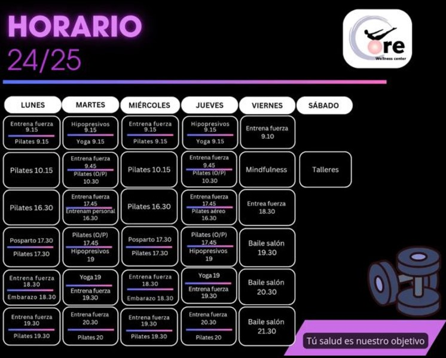

# Horarios

## Horarios de Clases

| Hora       | Lunes                | Martes               | Miércoles            | Jueves               | Viernes              |
|------------|----------------------|----------------------|----------------------|----------------------|----------------------|
| 08:00 - 09:00 | Yoga Gap (Monitor 1) | HIIT (Monitor 2)      | Pilates Mat (Monitor 1) | Tábata (Monitor 2)     | Entrenamiento Funcional (Monitor 1) |
| 09:00 - 10:00 | Pilates Mat (Monitor 2) | Yoga Gap (Monitor 1) | HIIT (Monitor 2)      | Pilates Mat (Monitor 1) | Tábata (Monitor 2)     |
| 18:00 - 19:00 | Entrenamiento Funcional (Monitor 1) | Pilates Mat (Monitor 2) | Yoga Gap (Monitor 1) | HIIT (Monitor 2)      | Pilates Mat (Monitor 1) |
| 19:00 - 20:00 | Tábata (Monitor 2)     | Entrenamiento Funcional (Monitor 1) | Pilates Mat (Monitor 2) | Yoga Gap (Monitor 1) | HIIT (Monitor 2)      |
| 20:00 - 21:00 | HIIT (Monitor 2)       | Tábata (Monitor 2)     | Entrenamiento Funcional (Monitor 1) | Pilates Mat (Monitor 2) | Yoga Gap (Monitor 1) |

## Contacto

Para más información o para inscribirte en nuestras clases, no dudes en contactarnos al ☎️ 6338.

¡Te esperamos en Core Sonseca para ayudarte a alcanzar tus objetivos de salud y fitness!