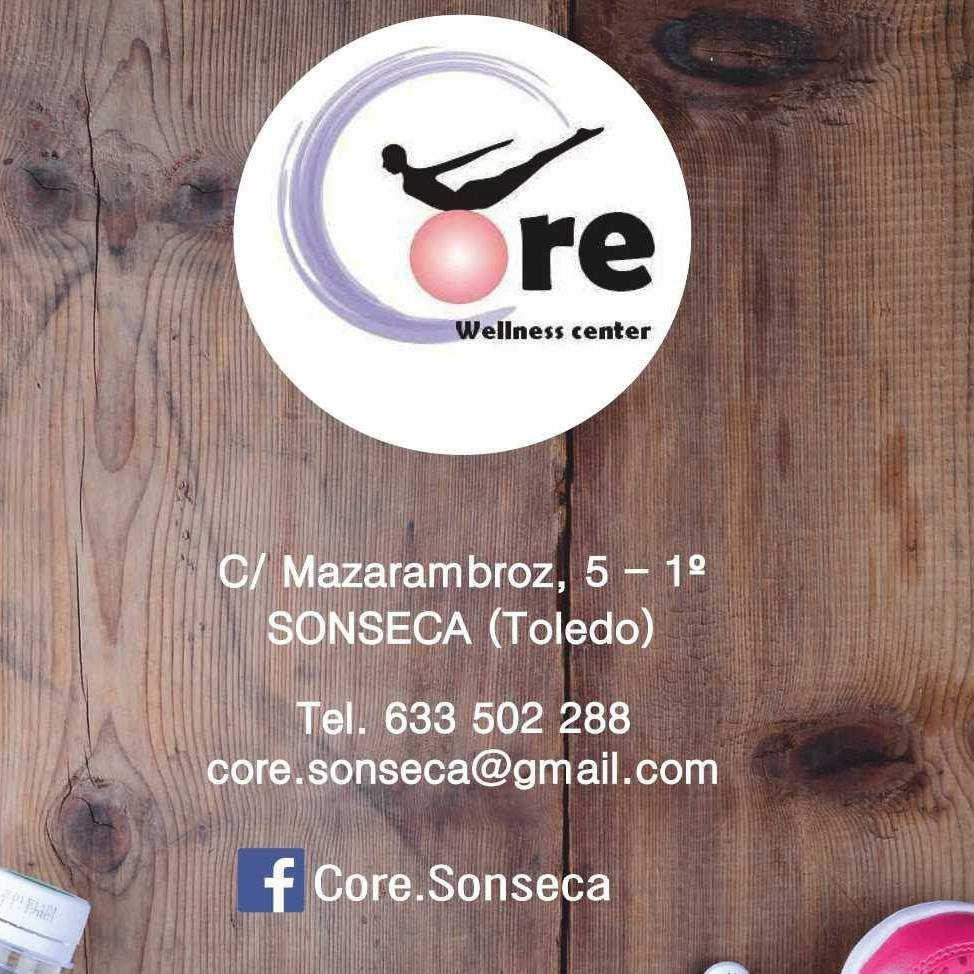

# Bienvenidos a Core Sonseca

En Core Sonseca, nos dedicamos a ofrecer una amplia gama de ejercicios para el cuerpo, incluyendo tonificación, musculación, entrenamiento personal y talleres de mindfulness. Nuestro objetivo es ayudarte a mejorar tu coordinación, equilibrio, movilidad, concentración, postura, respiración y, lo más importante, la conciencia corporal.

## Nuestros Servicios

En Core Sonseca, ofrecemos una variedad de clases y entrenamientos para satisfacer todas tus necesidades de fitness:

- **Yoga Gap**
- **Tábata**
- **Entrenamiento funcional**
- **HIIT**
- **Hipopresivos**
- **Pilates mat**
- **Pilates para embarazo y postparto**

## Ejercicio Online

Aunque ahora ofrecemos nuestras clases de manera online, no hemos dejado de hacer ejercicio. Queremos compartir contigo algunos tips sobre alimentación saludable junto con una rutina de actividad física para mantenerte en forma desde casa.

## Contacto

Para más información o para inscribirte en nuestras clases, no dudes en contactarnos al ☎️ 633502288.

¡Te esperamos en Core Sonseca para ayudarte a alcanzar tus objetivos de salud y fitness!

---

© 2024 Core Sonseca. Todos los derechos reservados.